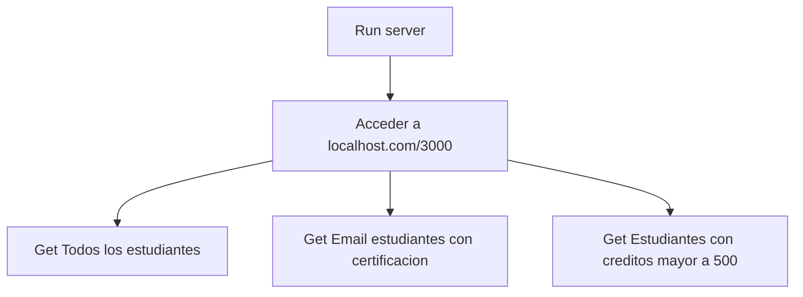
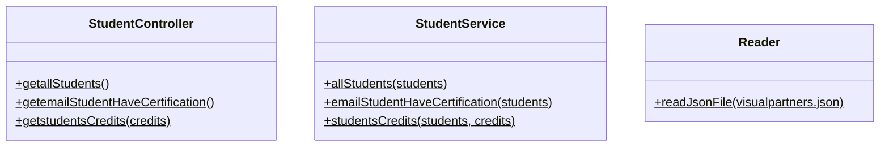

# Code Challenge por JaviMx / Javier Juárez
 Se realizara un API como proyecto de practica del programa **LAUNCH X**

Visual Partner-Ship te ha asignado el siguiente proyecto:

# Cursos de Visual Thinking API

Aquí encuentras la db en formato JSON de los estudiantes de Visual Partner-Ship: https://gist.github.com/carlogilmar/1f5164637fb77aecef3b9e6b9e2a9b63

Requerimientos:
1. Habilitar un endpoint para consultar todos los estudiantes con todos sus campos.
2. Habilitar un endpoint para consultar los emails de todos los estudiantes que tengan certificación `haveCertification`.
3. Habilitar un endpoint para consultar todos los estudiantes que tengan `credits` mayor a 500.

## Diagramas de flujo

## Diagrama de clases

## Funcionalidades del API / Endpoints

| Endpoint | Request | Response |
|---|---|---|
| `localhost:3000/` | `localhost:3000/` | Mensaje de Bienvenida |
| `localhost:3000/v1/students` | `localhost:3000/v1/students` | Presenta todos los datos de todos los estudiantes |
| `localhost:3000/v1/students/emails` | `localhost:3000/v1/students/emails` | Presenta los email de todos los estudiantes los cuales tienen certificacion |
| `localhost:3000/v1/students/credits` | `localhost:3000/v1/students/credits` | Presenta los estudiantes los cuales tienen más de 500 credits |

## Dependencias usadas en el proyecto

- Jest  -- Jest es una biblioteca para probar código JavaScript.

``
npm install jest@26.0.0 –-save-dev
``

- Express -- Es un entorno de trabajo para aplicaciones web para el programario Node.js, de código abierto y con licencia MIT. Se utiliza para desarrollar aplicaciones web y APIs

``
npm install express --save
``

- ESLint -- Los linters son herramientas de programación que examinan el código del programador y lo ayudan a corregir errores de sintaxis, código incorrecto, malas prácticas o incluso ayudarlo a seguir unas normas de estilo

``
npm install eslint --save-dev
``

## Funcionamiento del API

